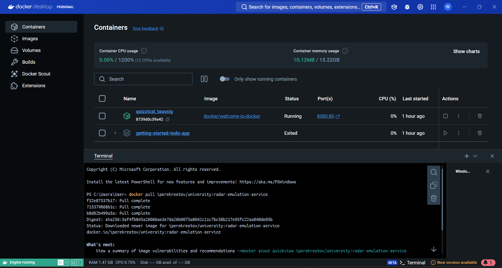
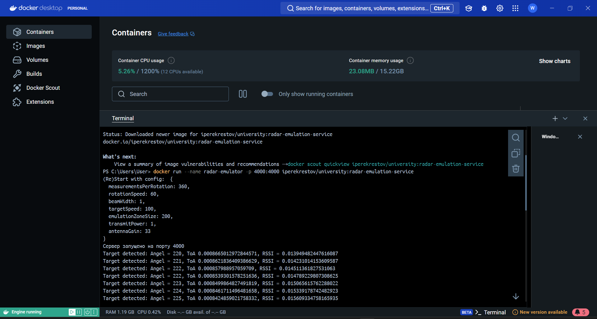
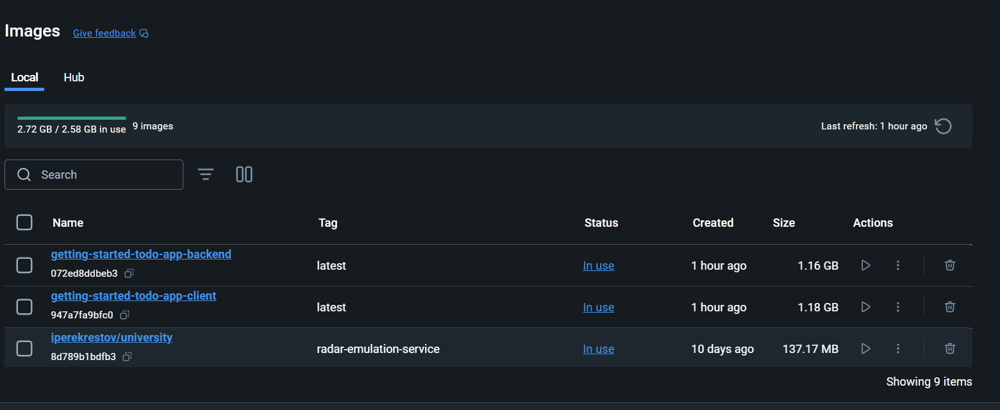
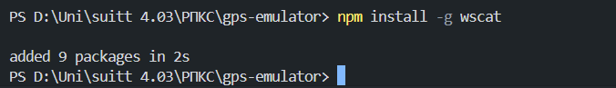
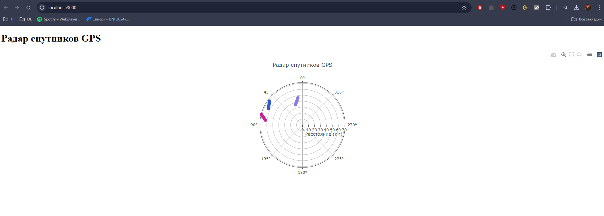
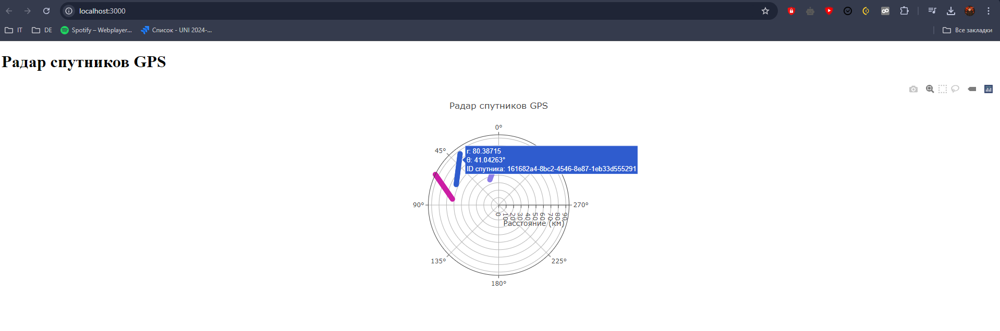

# virtualization-gps - Виконано
## Розробка додатку для візуалізації вимірювань GPS
Мета роботи
Розробити додаток, який зчитує дані з емульованої вимірювальної частини GPS, наданої у вигляді Docker image, та відображає положення об'єкта і супутників на графіку в декартових координатах.

- Завантаження та запуск емулятора вимірювальної частини GPS
 

- На наступному скріншоті можна побачити, як виводяться отримані дані з радарного сервісу
 
- На наступному скріншоті показаний процес встановлення необхідних залежностей для роботи додатку 

- Результат виконання роботи

